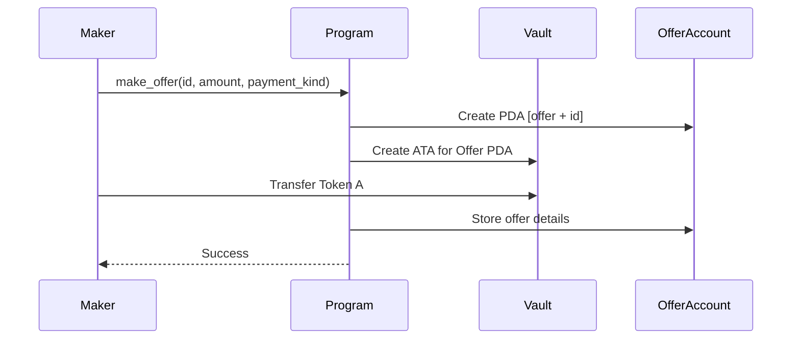
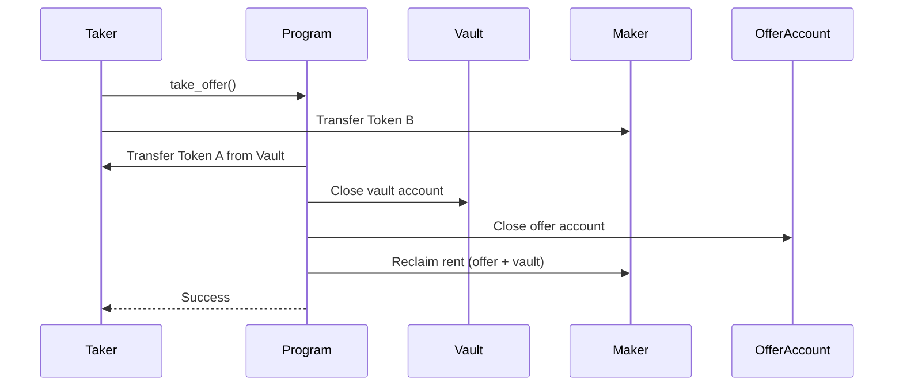
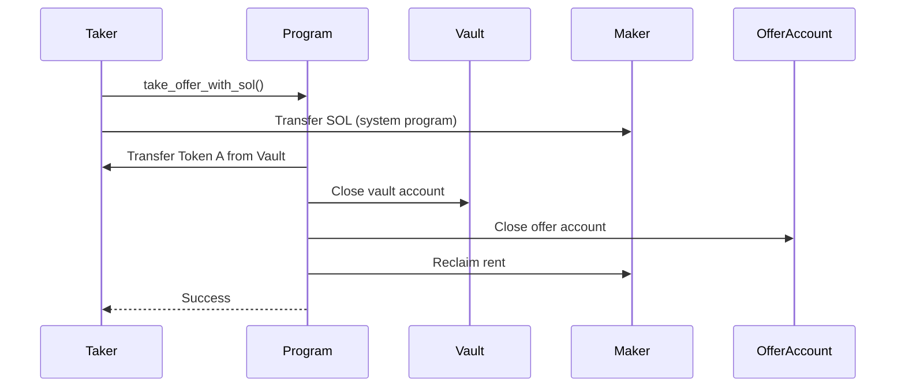
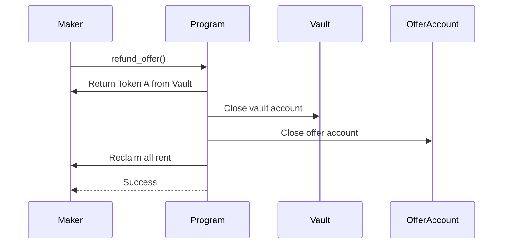

# NFT Marketplace - Solana Anchor Program

A decentralized peer-to-peer NFT/token trading platform built on Solana using Anchor framework. This program enables trustless escrow-based swaps where users can trade tokens (including NFTs) for other tokens or SOL.

## Program Overview

**Program ID:** `CGTG4etJpxd39CQp9nMRsVAwPT6P58zQF9XfT8zw6GhW`

The NFT Marketplace uses an escrow pattern where:
- **Makers** create offers by depositing tokens into a program-controlled vault
- **Takers** can accept offers by providing the requested payment
- **Makers** can refund their offers at any time before they're taken

### Key Features

- ✅ **Token-for-Token Swaps** - Trade any SPL token (including NFTs) for other tokens
- ✅ **Token-for-SOL Swaps** - Accept native SOL as payment
- ✅ **Escrow Security** - Program-controlled vaults ensure trustless trades
- ✅ **Flexible Offers** - Create, take, or refund offers
- ✅ **SPL Token 2022 Support** - Compatible with both classic and token extension programs

## Architecture & Flow

```mermaid
graph TD
    A[Maker Creates Offer] -->|Deposits Token A| B[Escrow Vault]
    B -->|Offer Account Created| C{Offer Active}
    C -->|Taker Accepts| D[Take Offer]
    C -->|Maker Cancels| E[Refund Offer]
    D -->|Token B → Maker| F[Maker Receives Payment]
    D -->|Token A → Taker| G[Taker Receives Token]
    D --> H[Vault & Offer Closed]
    E -->|Token A → Maker| I[Maker Gets Refund]
    E --> H
    
    style B fill:#3B2F2F
    style H fill:#3B2F2F
    style F fill:#3B2F2F
    style G fill:#3B2F2F
```



## Program Structure

```
anchor/programs/nftmarketplace/
├── src/
│   ├── lib.rs                    # Program entry point
│   ├── state/
│   │   ├── offer.rs              # Offer account structure
│   │   └── mod.rs
│   ├── handlers/
│   │   ├── make_offer.rs         # Create new offer
│   │   ├── take_offer.rs         # Accept token-for-token offer
│   │   ├── take_offer_with_sol.rs # Accept token-for-SOL offer
│   │   ├── refund_offer.rs       # Cancel and refund offer
│   │   ├── shared.rs             # Common utilities
│   │   └── mod.rs
│   ├── error.rs                  # Custom error codes
│   └── constants.rs              # Program constants
└── Cargo.toml
```

## How It Works

### 1. Make Offer



**Process:**
1. Maker specifies: offer ID, token amount, and desired payment (Token B or SOL)
2. Program creates offer account (PDA derived from `["offer", id]`)
3. Program creates associated token vault (controlled by offer PDA)
4. Tokens are transferred from maker's account to vault
5. Offer details stored on-chain

**Validations:**
- Token amounts must be > 0
- Cannot trade same token for itself
- Maker must have sufficient balance

### 2. Take Offer (Token-for-Token)



**Process:**
1. Taker calls `take_offer` with offer account
2. Taker transfers requested Token B to maker
3. Program transfers escrowed Token A from vault to taker
4. Vault and offer accounts closed
5. Rent reclaimed to maker

### 3. Take Offer (Token-for-SOL)



**Process:**
1. Similar to token-for-token but payment is native SOL
2. Uses system program for SOL transfer
3. No Token B accounts needed

### 4. Refund Offer



**Process:**
1. Only maker can call refund
2. Escrowed tokens returned to maker
3. All accounts closed and rent reclaimed

## Account Structures

### Offer Account

```rust
pub struct Offer {
    pub id: u64,                    // Unique identifier
    pub maker: Pubkey,              // Offer creator
    pub token_mint_a: Pubkey,       // Token being sold
    pub token_a_amount: u64,        // Amount locked in vault
    pub payment: PaymentKind,       // Desired payment
    pub bump: u8,                   // PDA bump seed
}

pub enum PaymentKind {
    Token { mint: Pubkey, amount: u64 },  // Specific token payment
    Sol { lamports: u64 },                // SOL payment
}
```

### PDA Seeds

| Account | Seeds | Authority |
|---------|-------|-----------|
| Offer | `["offer", id: u64]` | Program |
| Vault (ATA) | `[offer_pda, token_program, mint]` | Offer PDA |

## Prerequisites

### System Requirements
- **Rust** 1.75+ with `cargo`
- **Solana CLI** 2.0+
- **Anchor CLI** 0.32.1
- **Node.js** 18+ (for tests)
- **Yarn** (for dependency management)

### Installation

```bash
# Install Rust
curl --proto '=https' --tlsv1.2 -sSf https://sh.rustup.rs | sh

# Install Solana CLI
sh -c "$(curl -sSfL https://release.anza.xyz/stable/install)"

# Install Anchor CLI
cargo install --git https://github.com/coral-xyz/anchor --tag v0.32.1 anchor-cli

# Verify installations
rustc --version
solana --version
anchor --version
```

## Quick Start

## Quick Start

### 1. Clone and Setup

```bash
git clone https://github.com/zebra0307/NFT-Marketplace.git
cd NFT-Marketplace/anchor
yarn install
```

### 2. Build the Program

```bash
anchor build
```

This compiles the Rust program and generates the IDL (Interface Definition Language) file.

### 3. Run Tests

#### Option A: With Anchor (recommended)
```bash
# Starts local validator, deploys program, runs tests
anchor test

# Or with existing validator
anchor test --skip-local-validator
```

#### Option B: Manual Testing
```bash
# Terminal 1: Start local validator
solana-test-validator

# Terminal 2: Deploy program
anchor deploy

# Terminal 3: Run TypeScript tests
yarn test
```

### 4. Deploy to Devnet

```bash
# Configure Solana CLI for devnet
solana config set --url devnet

# Airdrop some SOL (if needed)
solana airdrop 2

# Deploy
anchor deploy --provider.cluster devnet
```

## Development Workflow

### Building

```bash
anchor build              # Build program + IDL
anchor build --verifiable # Reproducible build for verification
```

### Testing

```bash
anchor test                          # Full test suite with fresh validator
anchor test --skip-build             # Run tests without rebuilding
anchor test --skip-local-validator   # Use existing validator
yarn test                            # Run TypeScript tests only
```

### Local Development

```bash
# Start validator with program deployed
anchor localnet

# In another terminal, interact with your local cluster
solana balance  # Check your balance
solana program show <PROGRAM_ID>  # View program info
```

## Testing

### TypeScript Integration Tests

Located in `anchor/tests/nftmarketplace.test.ts`, these tests cover:

1. **Setup Mints and ATAs** - Create test tokens and accounts
2. **Make Offer (NFT for NFT)** - Create token-for-token offer
3. **Take Offer (NFT for NFT)** - Complete token swap
4. **Make Offer (NFT for SOL)** - Create token-for-SOL offer  
5. **Take Offer (NFT for SOL)** - Complete SOL payment
6. **Refund Offer** - Cancel and reclaim tokens

### Rust Unit Tests (Optional)

Integration tests with LiteSVM are available behind the `integration-tests` feature:

```bash
# Build with integration tests
anchor build --features integration-tests

# Run Rust integration tests
cargo test --features integration-tests
```

## Program Instructions

### 1. `make_offer`

**Creates a new offer by escrowing tokens**

```typescript
await program.methods
  .makeOffer(
    offerId,              // u64: Unique offer identifier
    tokenAAmount,         // u64: Amount to escrow
    paymentKind          // PaymentKind: Token or Sol
  )
  .accounts({
    maker: makerPublicKey,
    tokenMintA: mintA,
    // ... other accounts
  })
  .rpc();
```

**Parameters:**
- `id`: Unique u64 identifier for the offer
- `token_a_offered_amount`: Amount of Token A to lock in vault
- `payment_kind`: Either `Token { mint, amount }` or `Sol { lamports }`

### 2. `take_offer`

**Accepts a token-for-token offer**

```typescript
await program.methods
  .takeOffer()
  .accounts({
    taker: takerPublicKey,
    maker: makerPublicKey,
    tokenMintA: mintA,
    tokenMintB: mintB,
    offer: offerPda,
    // ... other accounts
  })
  .rpc();
```

### 3. `take_offer_with_sol`

**Accepts a token-for-SOL offer**

```typescript
await program.methods
  .takeOfferWithSol()
  .accounts({
    taker: takerPublicKey,
    maker: makerPublicKey,
    tokenMintA: mintA,
    offer: offerPda,
    // ... other accounts
  })
  .rpc();
```

### 4. `refund_offer`

**Cancels offer and returns escrowed tokens to maker**

```typescript
await program.methods
  .refundOffer()
  .accounts({
    maker: makerPublicKey,
    tokenMintA: mintA,
    offer: offerPda,
    // ... other accounts
  })
  .rpc();
```

## Error Codes

| Code | Name | Description |
|------|------|-------------|
| 6000 | `InvalidAmount` | Token amount must be greater than 0 |
| 6001 | `InvalidTokenMint` | Cannot trade same token for itself |
| 6002 | `InsufficientMakerBalance` | Maker doesn't have enough tokens |
| 6003 | `InsufficientTakerBalance` | Taker doesn't have enough payment |

## Security Considerations

### ✅ Implemented Security Features

1. **PDA Authority** - Vaults controlled by program PDAs, not user accounts
2. **Signer Verification** - Only makers can refund their offers
3. **Balance Checks** - Validates sufficient balances before transfers
4. **Rent Reclamation** - Closes accounts and returns rent to makers
5. **Token Program Interface** - Supports both SPL Token and Token-2022

## Project Structure

## Project Structure

```
anchor/
├── Anchor.toml                   # Anchor configuration
├── Cargo.toml                    # Workspace manifest
├── package.json                  # Node dependencies for tests
├── programs/
│   └── nftmarketplace/
│       ├── Cargo.toml           # Program dependencies
│       └── src/
│           ├── lib.rs           # Program entry & instruction routing
│           ├── constants.rs     # Program constants
│           ├── error.rs         # Error definitions
│           ├── state/
│           │   ├── mod.rs
│           │   └── offer.rs     # Offer account struct
│           └── handlers/
│               ├── mod.rs
│               ├── make_offer.rs
│               ├── take_offer.rs
│               ├── take_offer_with_sol.rs
│               ├── refund_offer.rs
│               └── shared.rs    # Common helper functions
├── tests/
│   └── nftmarketplace.test.ts  # TypeScript integration tests
├── src/
│   ├── index.ts                 # SDK exports
│   └── client/                  # Generated Codama client
└── target/
    ├── deploy/                  # Compiled .so program
    ├── idl/                     # Generated IDL JSON
    └── types/                   # TypeScript types
```

## Key Dependencies

### Rust Dependencies
```toml
[dependencies]
anchor-lang = "0.32.1"
anchor-spl = "0.32.1"

[dev-dependencies]
solana-kite = "0.2.1"    # Testing utilities
litesvm = "0.8.2"        # Lightweight Solana VM
solana-sdk = "3.0.0"     # Solana SDK types
spl-token = "9.0.0"      # SPL Token utilities
```

### TypeScript Dependencies
```json
{
  "devDependencies": {
    "vitest": "^3.2.4",
    "gill": "0.11.0",
    "typescript": "^5.9.2"
  }
}
```

## Client SDK Generation

This project uses **Codama** to auto-generate TypeScript clients from the Anchor IDL:

```bash
# After building the program
anchor build

# Generate TypeScript client
cd anchor
node codama.js
```

Generated files:
- `anchor/src/client/js/generated/` - Full TypeScript SDK
- `anchor/src/nftmarketplace-exports.ts` - Re-exports for easy imports

## Environment Variables

Create `.env` file in the anchor directory:

```bash
# RPC endpoint (optional, defaults to localhost)
ANCHOR_PROVIDER_URL=http://127.0.0.1:8899

# Wallet path (optional, defaults to ~/.config/solana/id.json)
ANCHOR_WALLET=~/.config/solana/id.json
```

## Common Issues & Solutions

### Issue: "Program not deployed"
```bash
# Solution: Deploy the program first
anchor deploy
```

### Issue: "Insufficient funds"
```bash
# Solution: Airdrop SOL to your wallet
solana airdrop 5
```

### Issue: "Account already exists"
```bash
# Solution: Use a different offer ID or close existing offer
```

### Issue: "anchor: command not found"
```bash
# Solution: Install Anchor CLI
cargo install --git https://github.com/coral-xyz/anchor --tag v0.32.1 anchor-cli
```

### Issue: Test failures with litesvm
```bash
# Solution: Ensure litesvm version is patched
# Check anchor/Cargo.toml has:
[patch.crates-io]
litesvm = { version = "0.8.2" }
```
## Roadmap

### Core Functionality ✅
-  Basic escrow mechanism
-  Token-for-token swaps
-  Token-for-SOL swaps
-  Refund mechanism
-  Integration tests

### Planned (to be implemented)
-  Partial fills for fungible tokens
-  Offer expiration with automatic refunds
-  Marketplace fee collection
-  Batch operations for multiple offers
-  Event logging for indexing

## Contributing

Contributions are welcome! Please follow these guidelines:

1. Fork the repository
2. Create a feature branch (`git checkout -b feature/amazing-feature`)
3. Commit your changes (`git commit -m 'Add amazing feature'`)
4. Push to the branch (`git push origin feature/amazing-feature`)
5. Open a Pull Request

## Resources

### Solana & Anchor
- [Solana Documentation](https://docs.solana.com/)
- [Anchor Book](https://www.anchor-lang.com/)
- [Solana Cookbook](https://solanacookbook.com/)
- [Anchor Examples](https://github.com/coral-xyz/anchor/tree/master/examples)

### SPL Tokens
- [SPL Token Documentation](https://spl.solana.com/token)
- [Token-2022 Extensions](https://spl.solana.com/token-2022)

## License

MIT License

