# NFT Marketplace - Anchor Program

A Solana-based NFT marketplace smart contract built with Anchor 0.32.1 that enables peer-to-peer NFT trading with flexible payment options (SPL tokens or SOL).

## Overview

This decentralized marketplace allows users to:
- **Create offers** to sell NFTs/tokens for either other SPL tokens or SOL
- **Take offers** by purchasing listed NFTs with the requested payment
- **Refund offers** to cancel listings and retrieve escrowed assets

The program uses Program Derived Addresses (PDAs) to securely escrow tokens during the offer lifecycle, ensuring trustless and atomic swaps.

## Architecture

```mermaid
graph TB
    subgraph "User Interactions"
        Maker[Maker Wallet]
        Taker[Taker Wallet]
    end
    
    subgraph "Program Accounts"
        Offer[Offer PDA<br/>stores trade terms]
        Vault[Vault ATA<br/>escrows NFT/token]
    end
    
    subgraph "Instructions"
        MakeOffer[make_offer]
        TakeOffer[take_offer /<br/>take_offer_with_sol]
        RefundOffer[refund_offer]
    end
    
    subgraph "Token Accounts"
        MakerATA_A[Maker Token A ATA]
        MakerATA_B[Maker Token B ATA]
        TakerATA_A[Taker Token A ATA]
        TakerATA_B[Taker Token B ATA]
    end
    
    Maker -->|1. Create offer| MakeOffer
    MakeOffer -->|2. Lock tokens| Vault
    MakeOffer -->|3. Store terms| Offer
    MakerATA_A -.->|transfer| Vault
    
    Taker -->|4. Accept offer| TakeOffer
    TakeOffer -->|5. Release tokens| TakerATA_A
    TakeOffer -->|6. Send payment| MakerATA_B
    Vault -.->|transfer| TakerATA_A
    TakerATA_B -.->|transfer| MakerATA_B
    TakeOffer -->|7. Close| Offer
    TakeOffer -->|8. Close| Vault
    
    Maker -->|Cancel offer| RefundOffer
    RefundOffer -->|Return tokens| MakerATA_A
    Vault -.->|transfer| MakerATA_A
    RefundOffer -->|Close| Offer
    RefundOffer -->|Close| Vault
    
    style Offer fill:#3B2F2F
    style Vault fill:#3B2F2F
    style MakeOffer fill:#3B2F2F
    style TakeOffer fill:#3B2F2F
    style RefundOffer fill:#3B2F2F
```



## Program Design

### State Management

#### Offer Account
```rust
pub struct Offer {
    pub id: u64,                    // Unique identifier chosen by maker
    pub maker: Pubkey,              // Wallet that created the offer
    pub token_mint_a: Pubkey,       // NFT/token being sold
    pub token_a_amount: u64,        // Amount locked in vault
    pub payment: PaymentKind,       // Payment terms (Token or Sol)
    pub bump: u8,                   // PDA bump seed
}
```

#### Payment Options
```rust
pub enum PaymentKind {
    Token { mint: Pubkey, amount: u64 },  // SPL token payment
    Sol { lamports: u64 },                 // Native SOL payment
}
```

### Program Instructions

#### 1. `make_offer`
**Purpose:** Create a new offer by escrowing tokens and storing trade terms

**Flow:**
1. Validate offer parameters (amounts > 0, different mints)
2. Create Offer PDA using `seeds = [b"offer", id]`
3. Create Vault ATA (owned by Offer PDA)
4. Transfer tokens from maker → vault
5. Store offer details on-chain

**Key Validations:**
- `token_a_offered_amount > 0`
- `payment_amount > 0`
- `token_mint_a ≠ payment_mint` (for token swaps)

**Accounts:**
```
maker: Signer
token_mint_a: Mint
maker_token_account_a: TokenAccount (mut)
offer: PDA (init) [seeds: b"offer" + id]
vault: ATA (init) [authority: offer PDA]
```

#### 2. `take_offer`
**Purpose:** Complete token-for-token swap

**Flow:**
1. Verify payment mint matches offer terms
2. Transfer vault tokens → taker
3. Transfer payment tokens (taker → maker)
4. Close vault account
5. Close offer account (rent returned to maker)

**Key Features:**
- Uses `init_if_needed` for taker/maker ATAs
- Atomic swap ensures both transfers succeed or revert
- PDA seeds validate offer ownership

**Accounts:**
```
taker: Signer
maker: SystemAccount (mut)
token_mint_a, token_mint_b: Mints
taker_token_account_a, taker_token_account_b: TokenAccounts
maker_token_account_b: TokenAccount (init_if_needed)
offer: PDA (close, has_one = maker)
vault: ATA (mut)
```

#### 3. `take_offer_with_sol`
**Purpose:** Complete NFT-for-SOL swap

**Flow:**
1. Verify payment kind is `Sol`
2. Transfer vault tokens → taker
3. Transfer lamports (taker → maker via system transfer)
4. Close vault and offer accounts

**Difference from `take_offer`:**
- Uses `SystemProgram::transfer` instead of SPL token transfer
- No token_mint_b required
- Direct lamport transfer to maker's system account

#### 4. `refund_offer`
**Purpose:** Cancel offer and return escrowed tokens to maker

**Flow:**
1. Verify signer is the original maker
2. Transfer vault tokens → maker
3. Close vault account
4. Close offer account (rent returned to maker)

**Security:**
- `has_one = maker` constraint prevents unauthorized refunds
- PDA derivation ensures correct offer account

## Testing

### Test Environment Setup

The test suite uses **LiteSVM** (lightweight Solana VM) for fast integration testing without running a full validator.

**Test Helpers:** (`src/escrow_test_helpers.rs`)
- `setup_escrow_test()` - Creates test environment with:
  - 2 token mints (9 decimals)
  - 2 users (Alice, Bob) with ATAs
  - Initial token distribution:
    - Alice: 10 Token A, 0 Token B
    - Bob: 0 Token A, 5 Token B

**Test Coverage:**
1. ✅ Basic offer creation
2. ✅ Duplicate ID prevention
3. ✅ Insufficient funds handling
4. ✅ Same-mint validation
5. ✅ Zero-amount validation
6. ✅ Token-for-token swap
7. ✅ NFT-for-SOL swap
8. ✅ Offer refund
9. ✅ Non-maker refund prevention
10. ✅ Insufficient taker funds

### Running Tests

**TypeScript Integration Tests:**
```bash
# With local validator running
anchor test --skip-local-validator

# Start validator, deploy, test, cleanup
anchor test
```

**Rust Unit Tests (gated):**
```bash
# Run integration tests with LiteSVM
cargo test --features integration-tests
```

## Project Structure

```
anchor/
├── programs/nftmarketplace/
│   ├── src/
│   │   ├── lib.rs                    # Program entry & instruction routing
│   │   ├── constants.rs              # Program constants
│   │   ├── error.rs                  # Custom error definitions
│   │   ├── state/
│   │   │   ├── offer.rs              # Offer account & PaymentKind enum
│   │   │   └── mod.rs
│   │   ├── handlers/
│   │   │   ├── make_offer.rs         # Create offer logic
│   │   │   ├── take_offer.rs         # Token swap logic
│   │   │   ├── take_offer_with_sol.rs# SOL payment logic
│   │   │   ├── refund_offer.rs       # Cancel offer logic
│   │   │   ├── shared.rs             # Shared utilities
│   │   │   └── mod.rs
│   │   ├── escrow_test_helpers.rs    # LiteSVM test utilities (gated)
│   │   └── tests.rs                  # Rust integration tests (gated)
│   └── Cargo.toml
├── tests/
│   └── nftmarketplace.test.ts        # TypeScript integration tests
├── src/
│   ├── client/                       # Codama-generated TS client
│   └── index.ts
├── Anchor.toml                       # Anchor workspace config
├── Cargo.toml                        # Workspace dependencies
└── package.json                      # Test dependencies

```

## Key Features

### Security
- **PDA-based escrow** - Tokens held by program-controlled accounts
- **Constraint validation** - Anchor's account constraints prevent unauthorized access
- **Atomic swaps** - All transfers succeed or revert together
- **Rent reclamation** - Closed accounts return rent to maker

### Flexibility
- **Dual payment modes** - Accept SPL tokens or native SOL
- **Token program agnostic** - Works with Token Program and Token Extensions
- **Unique offer IDs** - Makers can create multiple concurrent offers

### Efficiency
- **`init_if_needed`** - Automatically creates missing ATAs
- **Account closure** - Returns rent when offers complete/cancel
- **Optimized space** - Minimal on-chain storage with `InitSpace` derive

## Dependencies

**Anchor Framework:**
```toml
anchor-lang = "0.32.1"
anchor-spl = "0.32.1"
```

**Dev Dependencies (Testing):**
```toml
solana-kite = "0.2.1"      # Transaction helpers
litesvm = "0.8.2"          # Lightweight Solana VM
solana-sdk = "2.2.1"       # Solana core types
spl-token = "8.0.0"        # SPL token program
spl-associated-token-account = "7.0.0"
```

**Workspace Patches:**
```toml
[patch.crates-io]
litesvm = { version = "0.8.2" }  # Unified version across dependencies
```

## Program ID

**Localnet/Devnet:**
```
CGTG4etJpxd39CQp9nMRsVAwPT6P58zQF9XfT8zw6GhW
```

## Building

```bash
# Build program
anchor build

# Build with verification
anchor build --verifiable

# Generate IDL
anchor idl build
```

## Deployment

```bash
# Deploy to localnet
anchor deploy

# Deploy to devnet
anchor deploy --provider.cluster devnet

# Sync program ID
anchor keys sync
```

## Client Generation

The TypeScript client is auto-generated using **Codama** from the Anchor IDL:

```bash
# Generate TS client from IDL
npm run codama:js
```

**Generated exports:**
- `getMakeOfferInstructionAsync()`
- `getTakeOfferInstructionAsync()`
- `getTakeOfferWithSolInstructionAsync()`
- `getRefundOfferInstructionAsync()`
- `fetchOffer()` - Fetch offer account data
- `paymentKind()` - Payment enum helper

## Error Codes

```rust
pub enum ErrorCode {
    #[msg("Invalid amount: must be greater than 0")]
    InvalidAmount,
    
    #[msg("Invalid token mint: cannot swap same token")]
    InvalidTokenMint,
    
    #[msg("Insufficient maker balance")]
    InsufficientMakerBalance,
    
    #[msg("Insufficient taker balance")]
    InsufficientTakerBalance,
    
    #[msg("Invalid payment mint")]
    InvalidPaymentMint,
}
```

## Contributing

When modifying the program:

1. Update Rust code in `programs/nftmarketplace/src/`
2. Run `anchor build` to regenerate IDL
3. Run `npm run codama:js` to update TypeScript client
4. Add tests in `tests/` directory
5. Run `anchor test` to verify changes

---
